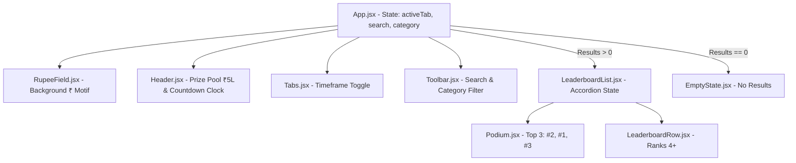

# ⚡ EYFI Challenge — Interactive Leaderboard

<div align="center">


[](https://reactjs.org/)
[](https://vitejs.dev/)
[](https://tailwindcss.com/)
[](LICENSE)
[](https://www.w3.org/WAI/standards-guidelines/wcag/)

**India's #1 Student Earning Challenge Leaderboard Web App**  
*Built for college hustlers freelancing, building SaaS, selling products, teaching, and performing.*

[View Live Demo](#-quick-start) • [Design System](#-design-system) • [Architecture](#-component-architecture) • [Features](#-features) • [Getting Started](#-getting-started)

</div>

---

## 📖 About The Project

**EYFI Challenge (Earn Your First Income)** is a 30-day earning competition designed for college students across India. Participants compete by generating real-world revenue across 5 hustle categories: **Freelance**, **Sell**, **Build**, **Teach**, and **Perform**.

This repository contains the interactive, mobile-first frontend web application tracking real-time rankings, prize pool distribution, earning streaks, and individual hustle breakdowns.

---

## ✨ Key Features

- 🏆 **Olympic Top 3 Podium**:
  - Classic **2 - 1 - 3** layout with visual elevation for the #1 earner.
  - Electric lime (`#CFFF3D`) highlight ring, glowing crown badge, and enlarged avatar cards.
  - Distinct rank medals for Gold, Silver, and Bronze tiers.

- 🔍 **Live Search & Category Filtering**:
  - Instant client-side search across participant names, colleges, and social handles.
  - Dropdown filter across 5 hustle categories (`Freelance`, `Sell`, `Build`, `Teach`, `Perform`) with compound `AND` logic.
  - Dedicated `EmptyState` fallback when zero participants match the active query.

- ⏱️ **Timeframe Toggle ("This Week" vs "All 30 Days")**:
  - Pill-style controlled toggle recalculating rankings and sorting descending by timeframe earnings.
  - Synchronizes amounts across both the top-3 podium and list rows in real-time.

- 📂 **Single-Row Expandable Drawer (Accordion)**:
  - Tapping any leaderboard row reveals a detailed drawer with project description, total challenge earnings, campus location, and verified earner credentials.
  - Coordinated state lifting ensures only **one row expands at a time** (automatically collapsing other rows).

- 🎨 **Ambient Floating ₹ Particle Motif**:
  - Full-screen background particle field with 10 faint floating Indian Rupee (`₹`) symbols drifting upward.
  - Built with pure CSS keyframes, zero layout shifts, and full **`prefers-reduced-motion`** support.

- 👤 **Deterministic Hash-Colored Avatars**:
  - Generates consistent, high-contrast avatar badge palettes based on participant name hashing.
  - Special `"YOU"` pill and lime-border highlight for the logged-in user's profile (`isMe: true`).

- ♿ **Accessibility (WCAG AA & Keyboard Operability)**:
  - Full ARIA semantics: `role="tablist"`, `role="tab"`, `aria-selected`, `aria-expanded`, and search/filter labels.
  - Keyboard operable with `Tab`, `Enter`, and `Space` key navigation.
  - High-visibility focus indicators (`focus-visible:ring-2 focus-visible:ring-accent`).

---

## 🎨 Design System

The application strictly follows a bespoke dark-mode design system with high-contrast electric lime accents tailored for mobile-first user experience.

| Token | Hex / Value | Description |
| :--- | :--- | :--- |
| **Background** | `#0A0A0A` | Ultra-dark canvas background |
| **Surface Card** | `#141414` | Primary card background with subtle borders |
| **Surface Alt** | `#1C1C1C` | Elevated drawer / podium highlight surface |
| **Border Subtle** | `#2A2A2A` | 1px border lines for cards and dividers |
| **Primary Accent** | `#CFFF3D` | Electric Lime Green for CTAs, #1 rank, and highlights |
| **Dimmed Accent** | `#8FB82B` | Secondary lime tone for subtle accents |
| **Text Primary** | `#F3F3EE` | Off-white text for maximum readability |
| **Text Muted** | `#8B8B85` | Secondary muted text meeting WCAG AA contrast |
| **Rank Gold** | `#E9C46A` | 1st Place medal color |
| **Rank Silver** | `#C9CBCF` | 2nd Place medal color |
| **Rank Bronze** | `#C97C4A` | 3rd Place medal color |
| **Typography** | `Plus Jakarta Sans` | Bold/Heavyweight sans-serif (800–900 weight headings) |

---

## 📂 Project Structure

```text
EYFI-Leaderboard/
├── index.html                  # HTML5 entrypoint with Plus Jakarta Sans & meta tags
├── package.json                # Project dependencies and npm scripts
├── postcss.config.js           # PostCSS configuration
├── tailwind.config.js          # Tailwind design tokens, colors & keyframe animations
├── vite.config.js              # Vite bundler configuration
├── src/
│   ├── main.jsx                # React root bootstrap
│   ├── App.jsx                 # Main layout, interactive state orchestration
│   ├── index.css               # Tailwind directives, animations & custom scrollbar
│   ├── components/
│   │   ├── Header.jsx          # Live pulse eyebrow, headline, prize pool & countdown clock
│   │   ├── Tabs.jsx            # "This Week" / "All 30 Days" controlled pill toggle
│   │   ├── Toolbar.jsx         # Search bar + hustle category <select> dropdown
│   │   ├── Podium.jsx          # Top 3 Olympic 2-1-3 cards with elevated #1 spot
│   │   ├── LeaderboardRow.jsx  # Single participant row with expandable detail drawer
│   │   ├── LeaderboardList.jsx # Maps ranked data to Podium + LeaderboardRow accordion
│   │   ├── RupeeField.jsx      # Animated floating ₹ background motif
│   │   └── EmptyState.jsx      # Zero-results feedback component
│   ├── data/
│   │   └── participants.json   # Realistic Indian college student mock dataset
│   └── utils/
│       ├── formatCurrency.js   # Indian Rupee numbering format (e.g. ₹1,82,400)
│       ├── rankData.js         # Pure filtering, sorting, and challenge stats calculator
│       └── avatarHelper.js     # Name-hash to deterministic color & initials extractor
└── README.md                   # Comprehensive project documentation
```

---

## 🧱 Component Architecture



---

## 📊 Data Model & API Ready

Mock data is stored in `src/data/participants.json` structured cleanly to allow swapping for a live REST or GraphQL backend without touching any UI component:

```json
{
  "id": "p-1",
  "name": "Aarav Sharma",
  "handle": "@aarav_codes",
  "avatar": "https://images.unsplash.com/photo-1539571696357-5a69c17a67c6?w=150&auto=format&fit=crop&q=80",
  "college": "IIT Delhi",
  "city": "New Delhi",
  "category": "Build",
  "hustle": "SaaS Micro-tool & Chrome Extension",
  "weeklyEarnings": 19200,
  "totalEarnings": 84500,
  "streakDays": 18,
  "isMe": false
}
```

---

## 🚀 Getting Started

### Prerequisites
- **Node.js**: `v18.0.0` or higher
- **npm**: `v9.0.0` or higher

### 1. Clone the Repository
```bash
git clone https://github.com/Roushan0012/EYFI-Leaderboard.git
cd EYFI-Leaderboard
```

### 2. Install Dependencies
```bash
npm install
```

### 3. Start Development Server
```bash
npm run dev
```
Open [http://localhost:3000](http://localhost:3000) (or the port indicated by Vite) in your browser.

### 4. Build for Production
```bash
npm run build
```
Production assets will be generated in the `dist/` directory ready for static hosting on Vercel, Netlify, or GitHub Pages.

---

## 📱 Responsive Breakpoints Tested

- 📱 **375px (iPhone SE / Small Mobile)**: Tested for zero horizontal scroll, compact podium cards, and responsive text truncation.
- 📱 **414px (iPhone 11/14 / Large Mobile)**: Full display of streak badges, category labels, and drawer content.
- 💻 **768px+ (Tablet & Desktop)**: Max-width 896px (`max-w-4xl`) container with centered layout and ambient top glow.

---

## 🤝 Contributing

Contributions, issues, and feature requests are welcome!
1. Fork the Project
2. Create your Feature Branch (`git checkout -b feature/AmazingFeature`)
3. Commit your Changes (`git commit -m 'feat: Add some AmazingFeature'`)
4. Push to the Branch (`git push origin feature/AmazingFeature`)
5. Open a Pull Request

---

## 📄 License

Distributed under the **MIT License**. See `LICENSE` for more information.

---

<div align="center">
  <b>Built with ⚡ for Indian College Hustlers</b><br>
  Made by <a href="https://github.com/Roushan0012">Roushan Kumar</a>
</div>
